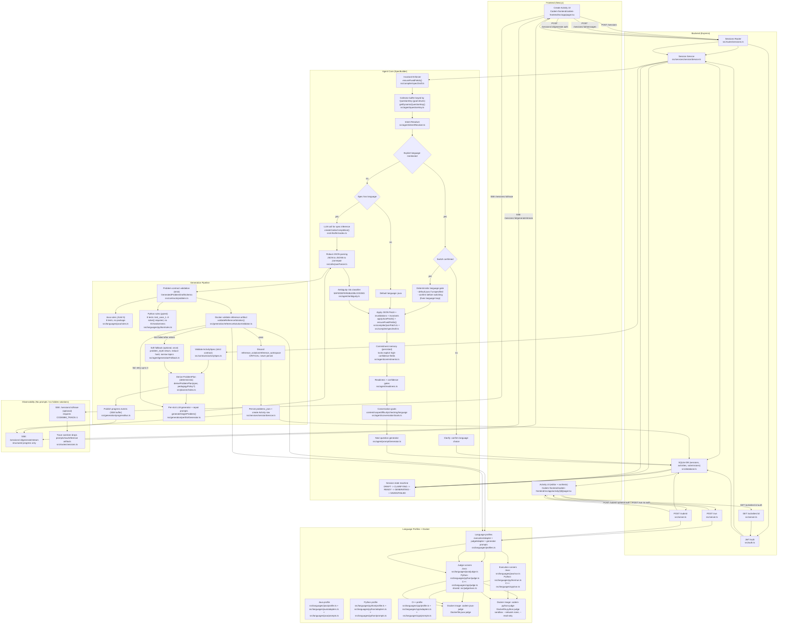
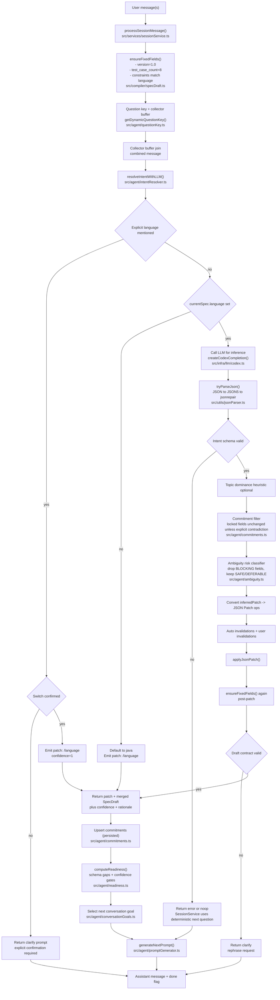
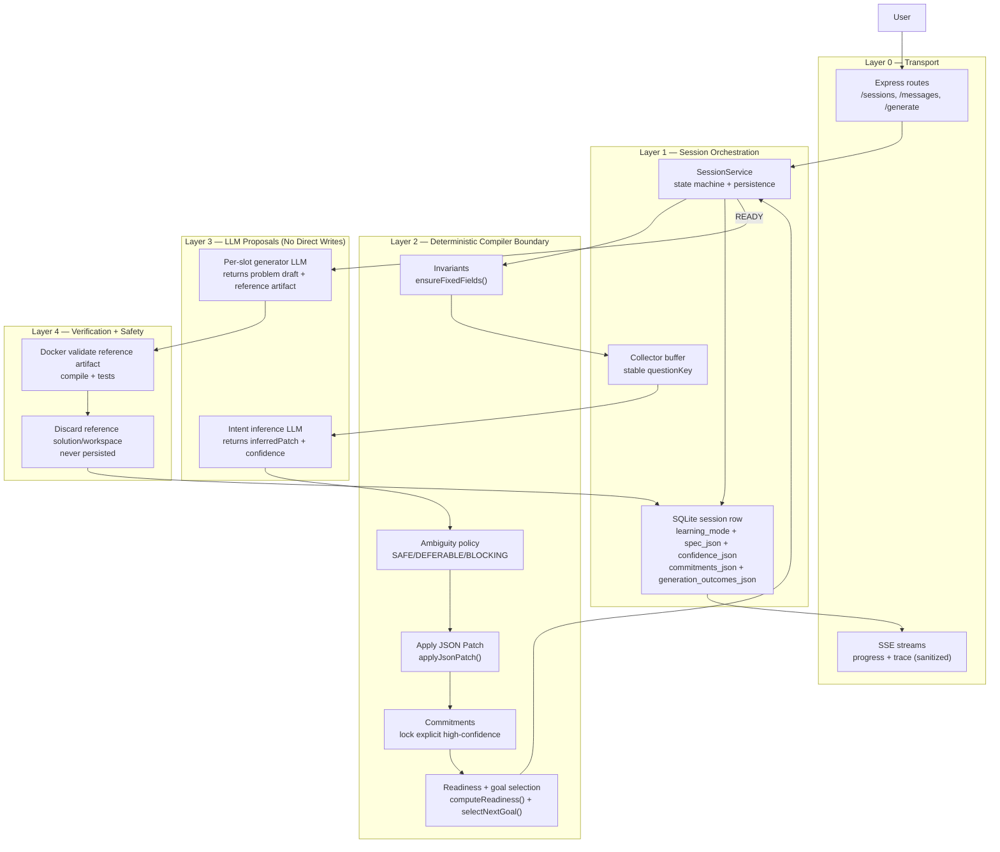

---
config:
  theme: redux
---

# Codemm — Agentic Platform (v1.x)

This diagram reflects the **current backend + agent architecture** in one end-to-end flow:

- **Create Activity (SpecBuilder agent loop)** via `/sessions`
- **Generate Activity** via `/sessions/:id/generate` + SSE progress
- **Run/Judge** via `/run` and `/submit` for **Java + Python**
- **Agentic intelligence (deterministic)**: commitment memory, ambiguity risk handling, goal-driven questions
- **Safety**: reference solutions are Docker-validated and then discarded (never persisted)
- **Observability**: structured progress SSE + optional trace SSE (sanitized, no prompts/raw solutions streamed)
 - **Activity UX (language-aware)**: learner UI uses per-problem `language` to select editor + runner behavior (Java `*.java`, Python `solution.py` + harness)

## Single End-to-End Diagram

---

## AI Agent Logic Only (SpecBuilder + Intent Resolution)

### Notes

- Spec invariants are enforced by `ensureFixedFields()` (`version`, `test_case_count=8`, and language-specific `constraints`).
- Session memory is persisted and auditable: commitments and generation outcomes are stored on the session row.
- Python generation currently supports **starter_code + reference_solution** (no workspace mode).
- Progress SSE (`/sessions/:id/generate/stream`) and trace SSE (`/sessions/:id/trace`) do **not** stream prompts, chain-of-thought, or hidden reference artifacts.

---

## AI Agent Layers (Deterministic Boundaries)

