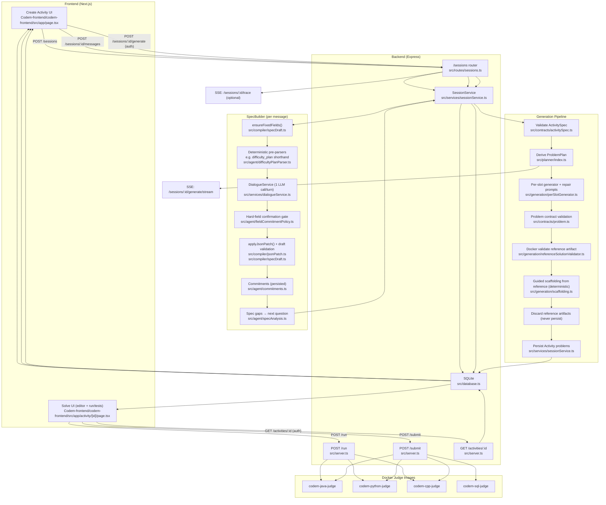
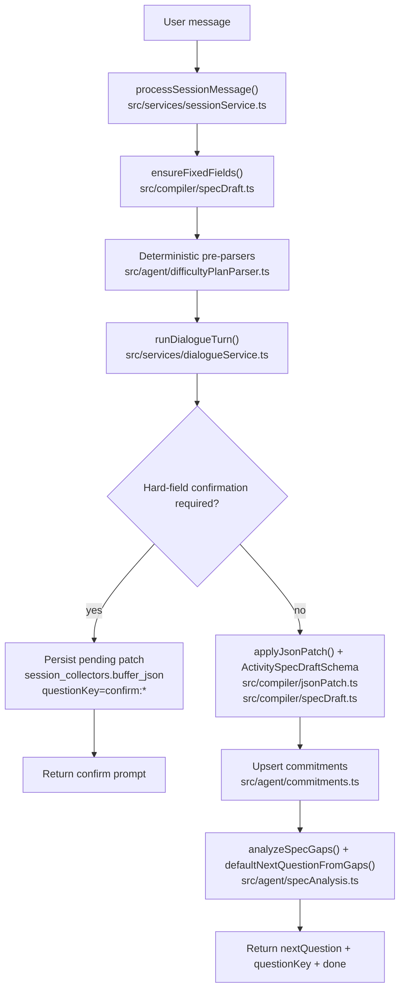

---
config:
  theme: redux
---

# Codemm — Agentic Platform (v1.x)

This document captures the current “agentic, but deterministic” system design:

- **SpecBuilder** (`/sessions`): 1 LLM call per user turn proposes a partial `ActivitySpec` patch; deterministic reducers apply patches, enforce Zod schemas/invariants, and pick the next question.
- **Generation** (`/sessions/:id/generate`): deterministic plan → per-slot generation → strict contracts → Docker validation → persist (reference artifacts discarded).
- **Execution/Judging**: `/run` (Java/Python/C++) and `/submit` (Java/Python/C++/SQL) inside Docker.
- **Guided Mode**: scaffolding is derived deterministically from validated reference artifacts; tests never change.
- **Observability**: progress SSE + optional sanitized trace SSE (no prompts/raw generations/reference artifacts streamed).

## Single End-to-End Diagram

## SpecBuilder Turn Loop (Chat → `ActivitySpec`)

## Deterministic Boundaries (Rules of the Road)

- LLM output is never trusted directly:
  - it’s parsed/validated, then translated into deterministic patch operations
  - invalid fields are never persisted
- Tests do not adapt to scaffolding; verification remains strict:
  - Docker is the safety boundary for generation
  - `/submit` is the safety boundary for learner code
- No chain-of-thought is stored or streamed:
  - trace/progress streams are structured and sanitized

